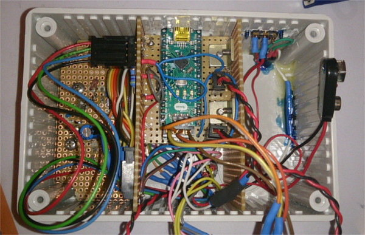

# Arduino Game Station


## Description

Inspired by [this](https://github.com/smaffer/vgax) library, I got the idea of creating a DIY "gaming console" based on an Arduino board. The challange was to not use expensive breakout boards or large microcontrollers. After some weeks of programming, soldering and manufacturing I managed to fit the Arduino Nano with batteries (6x 1.5V) and some basic gamepad-like buttons and joystick into a small grey box which is the "Arduino Game Station" that everyone is able to build theirselves.
Also special thanks to my dad who helped me wiring and soldering the whole device.

##Ok, wait, contain your excitement...

There are plenty limitations I need to mention. First of all the chip that is responsible of running the game and displaying the graphics has 32 kB of Program Memory (PROGMEM) and 2 kB of SRAM, which is veeeery small. Compared to Gaming PC or Laptop with 8 GB or more of RAM, the Arduino Nano or rather the ATmega328 chip can't really offer that much of computing power aaand we've only got one chip that needs to complete all tasks which are usually managed by RAM, CPU and GPU seperatly.
As a result of this the resolution the ATmega328 can offer is 120x60 pixels with 2 bit of colour depth at 60 frames per second. The resolution of modern PC's is probably 1920x1080 with 32 bit of colour depth.
But why is it so poor on the Arduino? Well, let's do some math:

```
120 (width) * 60 (height) = 7200 pixels
7200 pixels * 2 bit = 14400 bit = 1800 Byte
```

As I mentioned before the Arduino has 2 kB of SRAM which is 2048 Byte and since 1800 Byte are already taken we've only got 248 Byte left to store variables we need for the game to work, which is veeeery few space. So if you plan to program a game for this tiny "console" you'll need to program very carefully not blocking space unnecessarily. However I managed to program "Snake" on it, so it's not impossible :)

One may ask: "But what about those 32 kB of PROGMEM?". We are not able to access those 32kb dynamically but we can use this space to store constants such as strings or the pixel information of the font we'll use to display text. If you're still curious about PROGMEM look at the [Arduino reference about it](https://www.arduino.cc/en/Reference/PROGMEM).

## Requirements and wiring



### Things you'll need (to buy):

- Arduino Nano (with ATmega328)
- coloured wires
- VGA connector
- control elements (joysticks, buttons, switches etc.)
- 220 Ohm, 470 Ohm and 2x 10kOhm resistors
- decent soldering skills or a breadboard for assembling
- battery holder for 6x AA batteries or 9V battery (not recommended)

I was too lazy ordering a VGA connector so I cut a DVI to VGA adapter in half with a handsaw and used the remaining VGA part as the connector. **Not recommended** though.

### Wiring schematic

I tried my best creating a circuit diagram in [Fritzing](http://fritzing.org/home/) and uploaded the file into the `docs/` folder.


__Explanation:__

|         | Black  | Red  | Blue            | Green    | Orange        | Pink     | Brown            |
| ------- | ------ | ---- | --------------- | -------- | ------------- | -------- | ---------------- |
| Purpose | Ground | 5V   | 9V power supply | Buttons  | Colour output | Joystick | H-Sync and V-Sync |
| Pin(s)    | GND    | 5V   | VIN             | D11, D12 | D7, D6        | A1, A2   | D3, D9            |


__Note:__
- Unfortunately I was not able importing a VGA connector ([DE-15](https://en.wikipedia.org/wiki/VGA_connector)) into the program I used to create the schematic so you only see male pin headers with the labels "RGB", "H-Sync" and "V-Sync". I recommend taking a look at Smaffers [wiring diagram](https://github.com/smaffer/vgax/blob/master/docs/wire0.png) in order to wire it correctly.
- Make sure that you don't connect the analog joystick to A0 since it's already taken by the VGAX library

### Colour depth

As I've already mentioned before the Arduino Nano's video output has 2 bit colour depth. This means there 4 different colours that can be displayed: `00, 01, 10, 11`
Since we got three colour channels (Red, Green, Blue) we can only connect two of these channels (or three, see schematic) in order to display four colours. Depending on how you connect pin D7 and D6 with the RGB channels of the VGA output you can achieve different colour combinations. In my build I attached Red and Green to D7 with a 220 Ohm resistor and Blue to D6 with a 470 Ohm resistor to achieve the colours Black (00), Blue (01), Yellow(10) and White (11).
If you'd like to output different colours you should take a look at Smaffer's [list of all possible combinations](https://github.com/smaffer/vgax#4-colors).

## Coding

The code was made in the Arduino IDE you can download on the [Arduino website](https://www.arduino.cc/) for Windows, Linux and Mac. In case you aren't experienced in the Arduino but know how C or C++ works - don't worry! There's not much to learn if you already know one of those coding languages. Just take a look at this detailed [tutorial](https://www.arduino.cc/en/Tutorial/Blink) by the Arduino site and you'll understand most of specialities of programming an Arduino board.

### The game

Building and wiring is probably harder than coding the game but without software on our tiny chip the "console" is pretty useless. When I was a kid my mom got one of those (nowadays) infamous Nokia mobile phones with some "mobile games" on it, like tetris or snake that I've played and remember very well. So I thought I might code the chip so that you can play snake on it moving the main character (a snake) with a  two-axis joystick (no other buttons required).

I recommend that if you're building your own console you should take a look at games which were played in the beginning of gaming and computer games in general, like tetris, pong and such. It's quite simple reprogramming them, you shouldn't plan to code Super Mario Bros. onto the tiny chip. However if you succesfully code it onto the 248 byte of memory space you're a freakin' pro.

### Develop your own "Arduino Game Station"-Game

If you want to code your own game take a look at the wiki or contact me via e-mail. Nevertheless you can also use my version of snake on it by just uploading the Arduino code onto the Arduino Nano board.

_Happy Hacking!_


